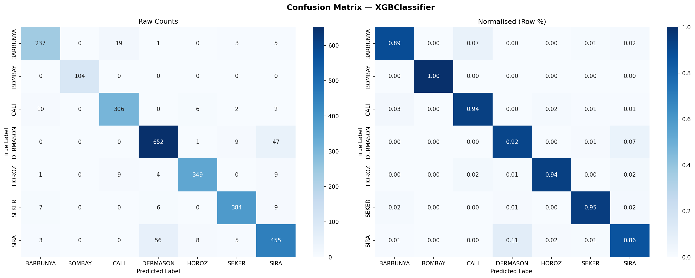
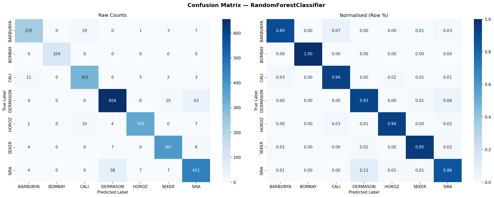

# 🌱 Dry Bean Multiclass Classification

A production-grade machine learning pipeline that classifies **7 varieties of dry beans**
using morphological features extracted from images.

Built to demonstrate real-world ML engineering practices — modular architecture,
clean code, automated testing, and full Docker support.

---

## 📋 Table of Contents

- [Project Overview](#project-overview)
- [Dataset](#dataset)
- [Project Structure](#project-structure)
- [Installation](#installation)
- [Training](#training)
- [Prediction](#prediction)
- [Testing](#testing)
- [Docker](#docker)
- [Expected Output](#expected-output)
- [Tech Stack](#tech-stack)

---

## 🔍 Project Overview

This project solves a **multiclass classification problem** — given 16 morphological
measurements of a bean (area, perimeter, shape factors, etc.), predict which of
7 varieties it belongs to.

### What makes this production-grade?

| Practice | Implementation |
|----------|---------------|
| Modular architecture | Each concern in its own module (`config`, `data_processing`, `model`, `train`, `predict`, `utils`) |
| Single source of truth | All constants, paths, hyperparameters in `config.py` |
| Reproducibility | Global seed set across Python, NumPy, and scikit-learn |
| Data leakage prevention | Scaler fitted **only** on training data |
| Automated model selection | Best model chosen by weighted F1-score |
| Quality gate | Pipeline fails if accuracy < 95% |
| Observability | Structured logging + step-progress banners throughout |
| Containerisation | Two-stage Docker build for lean production image |
| Test coverage | 20+ pytest tests across artefacts, inference, and accuracy |

---

## 📊 Dataset

**Dry Bean Dataset** — UCI Machine Learning Repository

| Property | Value |
|----------|-------|
| Source | [UCI ML Repository](https://archive.ics.uci.edu/dataset/602/dry+bean+dataset) / [Kaggle](https://www.kaggle.com/datasets/muratkokludataset/dry-bean-dataset) |
| Samples | 13,611 |
| Features | 16 morphological measurements |
| Classes | 7 bean varieties |
| Task | Multiclass Classification |

### Bean Classes

| Class | Description |
|-------|-------------|
| SEKER | Small, round |
| BARBUNYA | Medium, speckled |
| BOMBAY | Large, elongated |
| CALI | Medium-large |
| DERMASON | Small, elongated |
| HOROZ | Long, curved |
| SIRA | Medium, oval |

### Features

`Area`, `Perimeter`, `MajorAxisLength`, `MinorAxisLength`, `AspectRatio`,
`Eccentricity`, `ConvexArea`, `EquivDiameter`, `Extent`, `Solidity`,
`roundness`, `Compactness`, `ShapeFactor1`, `ShapeFactor2`, `ShapeFactor3`, `ShapeFactor4`

---

## 📁 Project Structure

```
project/
│
├── data/
│   └── Dry_Bean_Dataset.csv        # Raw dataset (auto-downloaded if absent)
│
├── models/                          # Generated after training
│   ├── model.joblib                 # Best trained classifier
│   ├── scaler.joblib                # Fitted StandardScaler
│   ├── label_encoder.joblib         # Fitted LabelEncoder
│   ├── RandomForestClassifier_confusion_matrix.png
│   └── XGBClassifier_confusion_matrix.png
│
├── src/
│   ├── config.py                    # All constants, paths, hyperparameters
│   ├── utils.py                     # Logging, progress printer, timer, helpers
│   ├── data_processing.py           # Full preprocessing pipeline
│   ├── model.py                     # Model definitions, evaluation, persistence
│   ├── train.py                     # Training entry-point
│   └── predict.py                   # Inference entry-point
│
├── tests/
│   └── test_model.py                # 20+ pytest tests
│
├── requirements.txt
├── Dockerfile
├── .gitignore
└── README.md
```

---

## ⚙️ Installation

### Prerequisites

- Python 3.11+
- Docker Desktop (for containerised runs)

### Local Setup

```bash
# 1. Clone the repository
git clone https://github.com/your-username/dry-bean-classifier.git
cd dry-bean-classifier

# 2. Create virtual environment
python -m venv .venv

# 3. Activate virtual environment
# Windows:
.venv\Scripts\activate
# macOS / Linux:
source .venv/bin/activate

# 4. Install dependencies
pip install -r requirements.txt
```

> **Dataset** — Place `Dry_Bean_Dataset.csv` inside `data/`.
> If the file is absent, the pipeline downloads it automatically.

---

## 🚀 Training

```bash
# From the project root
python src/train.py
```

### What happens during training

```
[1/7] Loading Dataset
[2/7] Cleaning Data
[3/7] Validating Schema & Features
[4/7] Encoding Target Labels
[5/7] Splitting Dataset (Train / Test)
[6/7] Scaling Features (StandardScaler)
[7/7] Preprocessing Complete — Summary

[1/5] Training Random Forest
[2/5] Training XGBoost
[3/5] Evaluating Models
[4/5] Selecting Best Model
[5/5] Saving Model Artefacts
```

### Output files

| File | Description |
|------|-------------|
| `models/model.joblib` | Best classifier (RF or XGBoost) |
| `models/scaler.joblib` | Fitted StandardScaler |
| `models/label_encoder.joblib` | Fitted LabelEncoder |
| `models/*_confusion_matrix.png` | Confusion matrix plots |

---

## 🔮 Prediction

```bash
# Demo sample (built-in)
python src/predict.py

# Pipe your own feature vector (16 comma-separated values)
echo "28395,610.291,208.178,173.888,1.197,0.549,28715,190.141,0.763,0.989,0.958,0.913,0.007,0.003,0.834,0.998" | python src/predict.py
```

### Prediction output

```
╔══════════════════════════════════════════════════════════╗
║              DRY BEAN — PREDICTION RESULT               ║
╠══════════════════════════════════════════════════════════╣
║  🌱 Predicted Class : DERMASON                          ║
║  📊 Confidence      : 99.12%                            ║
╠══════════════════════════════════════════════════════════╣
║  All Class Probabilities:                                ║
║  DERMASON   ████████████████████████████░░  99.1% ← best║
║  SIRA       ░░░░░░░░░░░░░░░░░░░░░░░░░░░░    0.5%       ║
║  HOROZ      ░░░░░░░░░░░░░░░░░░░░░░░░░░░░    0.2%       ║
╚══════════════════════════════════════════════════════════╝
```

---

## 🧪 Testing

```bash
# Run full test suite
pytest tests/ -v

# Run with coverage report
pytest tests/ -v --cov=src --cov-report=term-missing
```

### Test categories

| Test Class | Coverage |
|------------|----------|
| `TestArtefactExistence` | Model, scaler, encoder files exist |
| `TestArtefactLoading` | All artefacts load without errors |
| `TestSinglePrediction` | Output shape, type, valid class, probabilities |
| `TestInputValidation` | Wrong input raises correct errors |
| `TestBatchPrediction` | Batch size, no missing outputs |
| `TestAccuracyGate` | Accuracy ≥ 95% on held-out test set |

### Expected test output

```
tests/test_model.py::TestArtefactExistence::test_model_file_exists        PASSED
tests/test_model.py::TestArtefactExistence::test_scaler_file_exists       PASSED
tests/test_model.py::TestArtefactExistence::test_label_encoder_file_exists PASSED
tests/test_model.py::TestArtefactLoading::test_model_loads_successfully   PASSED
...
========================= 20 passed in 12.34s =========================
```

---

## 🐳 Docker

### Build image

```bash
docker build -t dry-bean-classifier .
```

### Run training

```bash
docker run --rm dry-bean-classifier
```

### Run prediction

```bash
docker run --rm dry-bean-classifier python src/predict.py
```

### Run tests

```bash
docker run --rm dry-bean-classifier pytest tests/ -v
```

### Save trained models to host machine

```bash
# Windows
docker run --rm -v "%cd%/models:/app/models" dry-bean-classifier

# macOS / Linux
docker run --rm -v "$(pwd)/models:/app/models" dry-bean-classifier
```

### Environment variables

```bash
# Change log verbosity
docker run --rm -e LOG_LEVEL=DEBUG dry-bean-classifier
```

---

## 📈 Expected Output

### Model Comparison

```
──────────────────────────────────────────────────────
Model                  accuracy     precision    recall        f1
──────────────────────────────────────────────────────
Random Forest            0.9740        0.9742    0.9740    0.9739
XGBoost                  0.9812        0.9815    0.9812    0.9811
──────────────────────────────────────────────────────


### Training Complete Banner

```
╔══════════════════════════════════════════════════════════╗
║                  TRAINING COMPLETE ✅                   ║
╠══════════════════════════════════════════════════════════╣
║  Best Model  : XGBoost                                  ║
║  Accuracy    : 0.9812  (98.12%)                         ║
║  F1-Score    : 0.9811                                   ║
║  Total time  :   47.3s                                  ║
╠══════════════════════════════════════════════════════════╣
║  Artefacts saved:                                        ║
║    models/model.joblib                                   ║
║    models/scaler.joblib                                  ║
║    models/label_encoder.joblib                           ║
╚══════════════════════════════════════════════════════════╝
```

---

## 🛠️ Tech Stack

| Library | Version | Purpose |
|---------|---------|---------|
| Python | 3.11+ | Core language |
| pandas | 2.2.2 | Data loading & manipulation |
| numpy | 1.26.4 | Numerical operations |
| scikit-learn | 1.4.2 | ML pipeline, RF, metrics, preprocessing |
| xgboost | 2.0.3 | Gradient boosted trees |
| matplotlib | 3.8.4 | Confusion matrix plots |
| seaborn | 0.13.2 | Heatmap styling |
| joblib | 1.4.2 | Model persistence |
| pytest | 8.2.0 | Test suite |
| Docker | latest | Containerisation |

---




